# Erachain DEX Bot Trader
## Торговый робот для децентрализованной биржи в Erachain

Позволяет получать курсы обмена с разных бирж (настройка внутри кода),
 и выставлять на децентрализованную биржу Эрачейн свои заявки по заданному алгоритму.

Для работы бота нужно запустить на локальной машине полную ноду Эрачейн
 и открыть доступ по RPC (на порт 127.0.0.1) и задать пароль у кошелька более 8-ми символов.
  Перезадать пароль можно так:
 + удалить из рабочей папки ноды папки walletKeys и dataWallet
 + запустить ноду и восстановить по СИДу кошелек и задать нужный пароль 

## Разорачивание проекта в IDEA
Установите пакет разработки IDEA и java JDK 1.8

### Скопируйте ссылку с Git
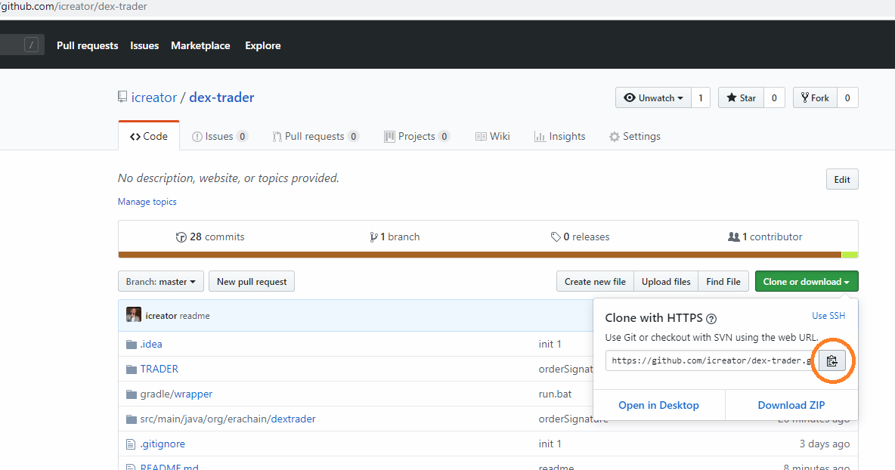

### Начните новый проект в IDEA из репозитория Git
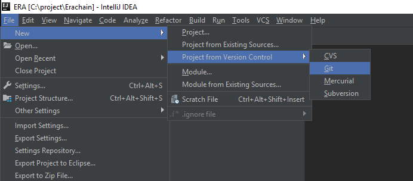

### Вставьте ссылку
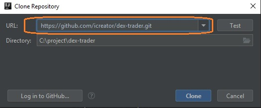
И нажмите Clone - проект скопируется с репозитария и IDEA предложит настроить Gradle

### Нажмите "Настроить Gradle"
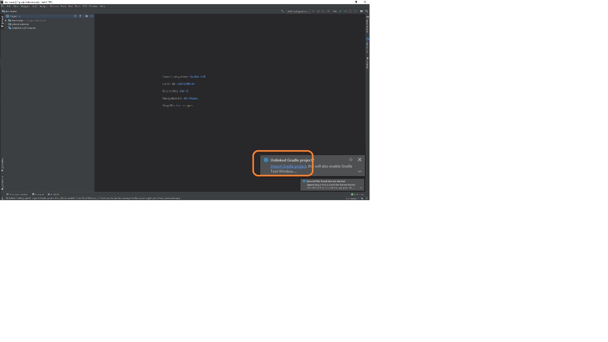

### Настроить Gradle
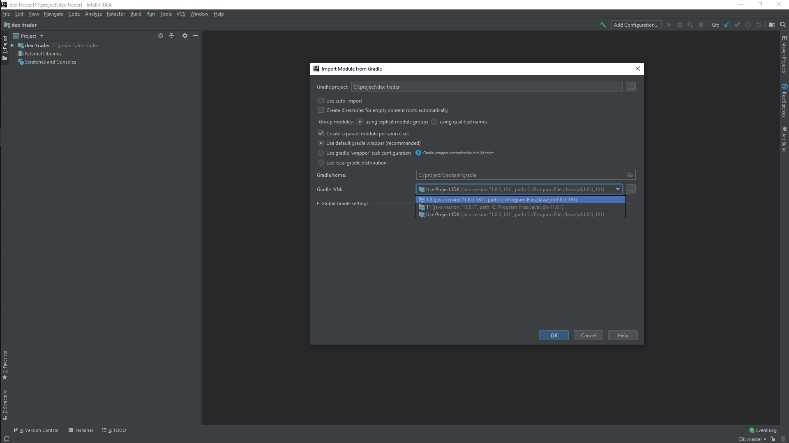
Задайте JDK 1.8
 

### Настройка библиотек
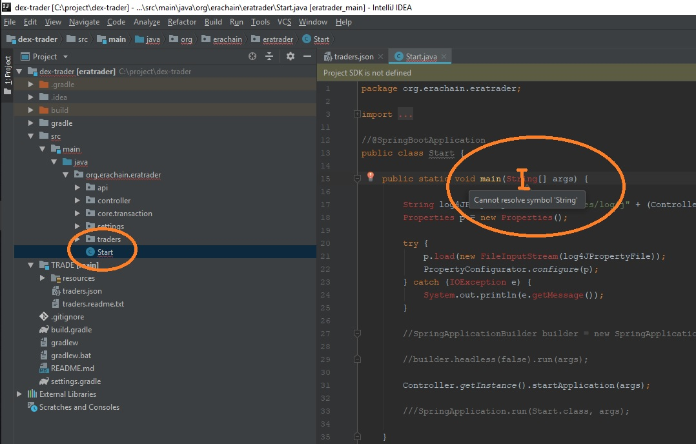
Откройте файл Start, в нем поставьте курсор на любое красное слово String
 и нажмите Att-Enter.

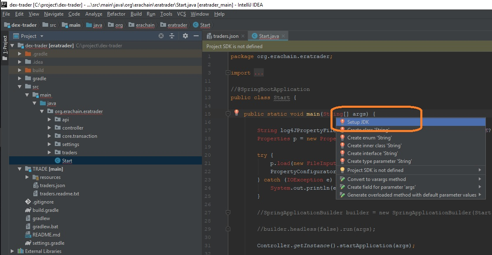

В появившемся списке выберите Задать JDK. Выберите JDK 1.8

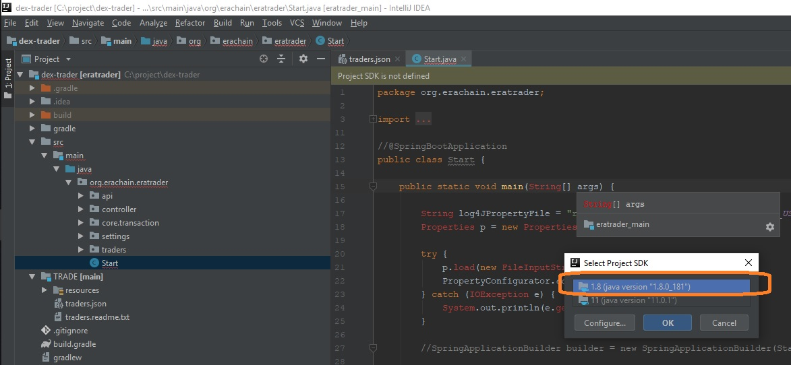

### Создайте Запуск приложения
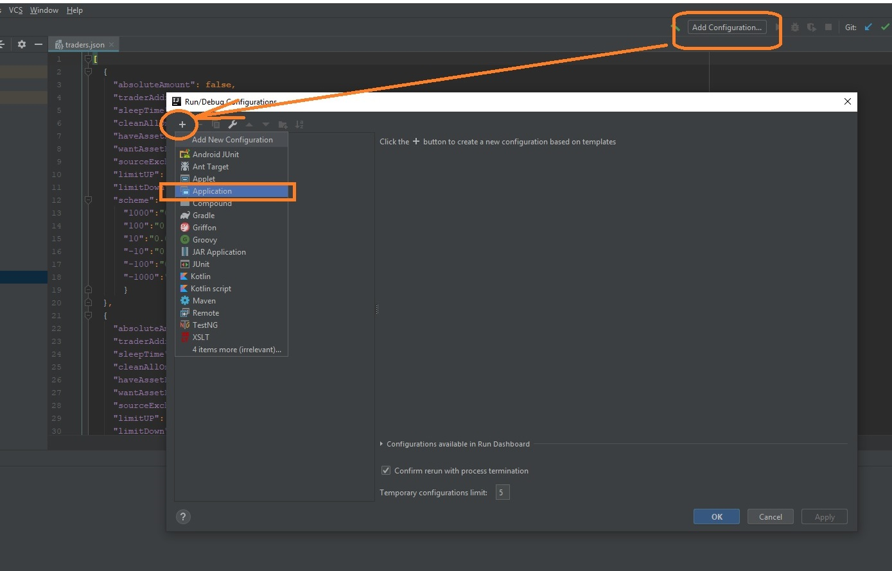

### Задайте класс запуска
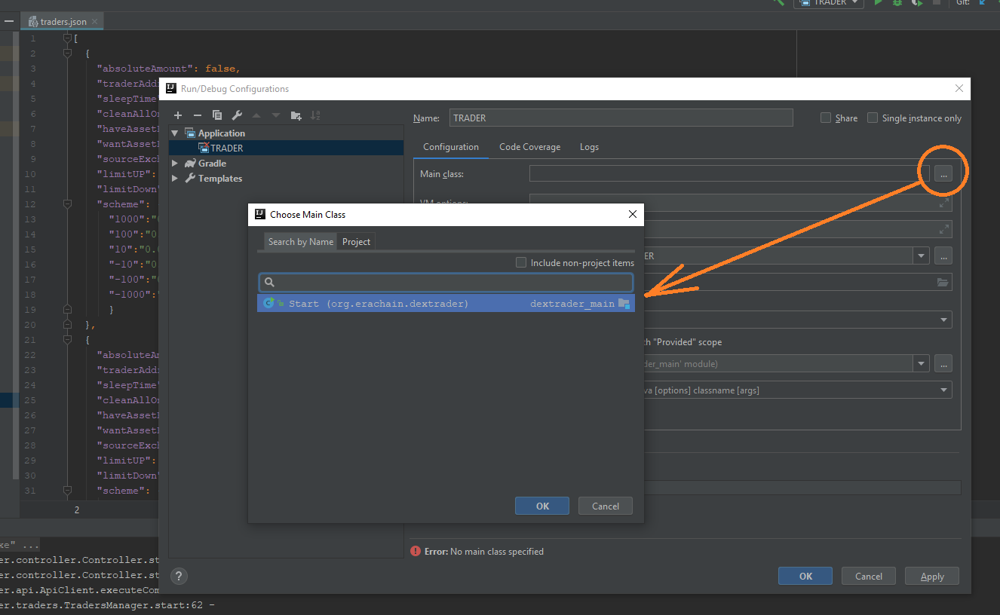

### Настройте параметры запуска
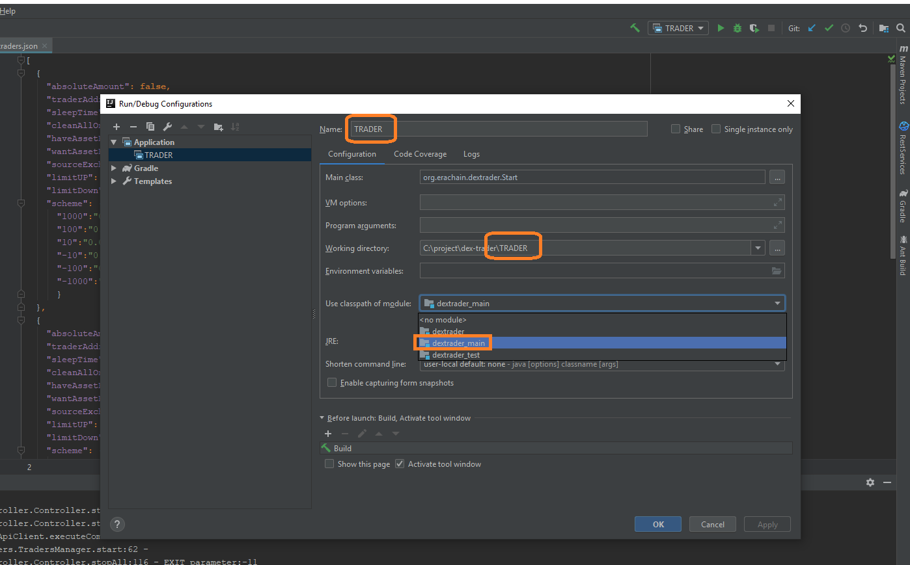
Имя, Путь, Модуль

### Настройте торговцев
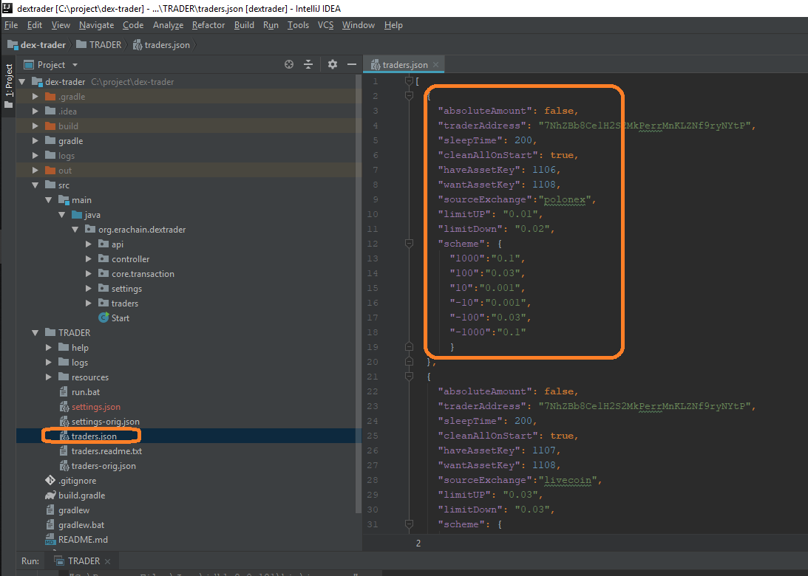
Скопируйте файл traders-orig.json в traders.json и задайте в нем настройки своих трейдеров.
Описание настроек находится в файле traders.readme.txt

### Запус программы из IDEA и выкладка и обновление на GitHub
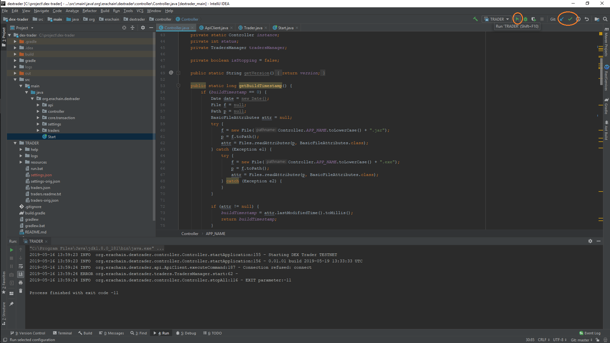

### Создание JAR файла для запуска отдельно от IDEA
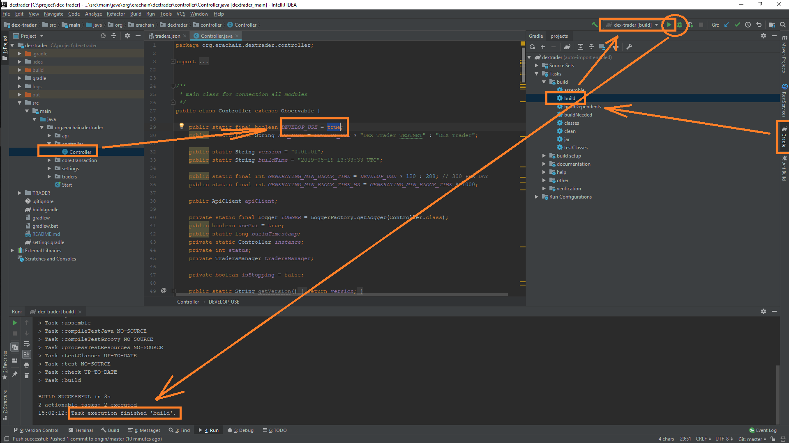
Откройте закладку Gradle и двойной клик по build - он запустит сборку JAR
 и создаст настройку запуска (правый верхний угол) - можно будет потом запускать эту сборку быстро по кнопку Запуск
 
 Там же вверху кнопка для отладки
 
 После того как сборка закончилась нужные файлы будут лежать в папке dex-trader\build\libs\DEXTrader
 
 Для авбора нужной сети блокчейн - отладочная или боевая используйте настройку в org.erachain.dextrader.controller.Controller.DEVELOP_USE
 
 Лучше всего запускать run.bat - так как там вставлен циклический запуск и другие настройки
 
 Логи см в папке logs
 
 Если доступа к полной ноде нет то прога выйдет сразу же
 
 ## Настройка источников для получени курсов
 Есть 4 курсовика (настройка пар внутри кода):
  + RaterLiveCoin - за одинзапрос только одну пару
  + RaterLiveCoinRUR - за одинзапрос только одну пару
  + RaterPolonex - за один запрос выбирает все пары
  + RaterWEX - бывший BTC-e, сейчас не работает
 
 > Каждый курсовик использует АПИ соотвествующей биржи. Так как данные бесплатные,
  не рекомендую чаще чем раз в 10 минут получать курсы 
 
 
