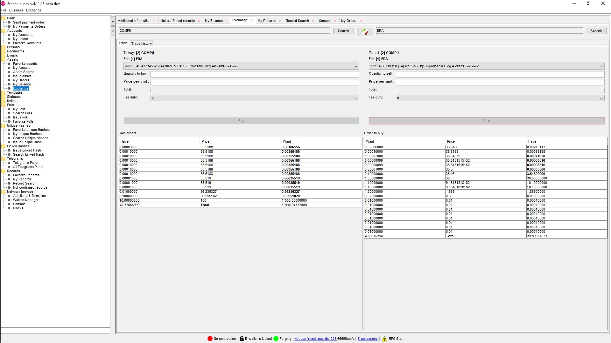

# Erachain DEX Bot Trader
## Торговый робот для децентрализованной биржи в Erachain

Позволяет получать курсы обмена с разных бирж (настройка внутри кода),
 и выставлять на децентрализованную биржу Эрачейн свои заявки по заданному алгоритму.

Для работы бота нужно запустить на локальной машине полную ноду Эрачейн
 и открыть доступ по RPC (на порт 127.0.0.1) и задать пароль у кошелька более 8-ми символов.
  Перезадать пароль можно так:
 + удалить из рабочей папки ноды папки walletKeys и dataWallet
 + запустить ноду и восстановить по СИДу кошелек и задать нужный пароль 

## См. как [Развернуть проект в IDEA](README-start.md)

#### Выбор сети - тестовая или боевая 
 Для выбора нужной сети блокчейн - отладочная или боевая используйте настройку в org.erachain.dextrader.controller.Controller.DEVELOP_USE

#### Циклический запуск
 Лучше всего запускать run.bat - так как там вставлен циклический запуск и другие настройки

#### Проверка жизнидеятельности
 Логи см в папке logs
 
#### Принудительный останов
 Нажмите в черном окошке, где крутится прога Crtl-C

#### Ghbvtxfybz
 Если доступа к полной ноде нет то прога выйдет сразу же
 
#### Настройка источников для получени курсов
 Есть 4 курсовика (настройка пар внутри кода):
  + RaterLiveCoin - за одинзапрос только одну пару
  + RaterLiveCoinRUR - за одинзапрос только одну пару
  + RaterPolonex - за один запрос выбирает все пары
  + RaterWEX - бывший BTC-e, сейчас не работает
 
 > Каждый курсовик использует АПИ соотвествующей биржи. Так как данные бесплатные,
  не рекомендую чаще чем раз в 10 минут получать курсы 
 
 
